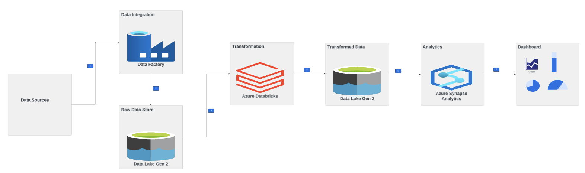

# Tokyo Olympic Data Engineering pipeline using azure DataFactory, Databricks, Data Lake Storage, Synapse Analytics

## Introduction
This project demonstrates an end-to-end data pipeline built using **Azure Data Factory**, **Azure Data Lake Storage**, **Databricks**, and **Synapse Analytics**. 

The workflow involves:
- Extracting data from Kaggle and hosting it on GitHub.
- Loading the data into ADLS buckets using Azure Data Factory via HTTP server.
- Transforming the data using Databricks.
- Analyzing the transformed data with Synapse Analytics to derive meaningful insights.
Explore this repository to learn how these Azure services work together to enable efficient data integration, transformation, and analysis.

## Architecture

## Technology Used
1. Programming Language - Python, PySpark
2. Scripting Language - SQL
3. Azure Cloud Platform
   - DataFactory
   - Data Lake Storage
   - Databricks
   - Synapse Analytics
  
## Dataset Used
Here is the dataset used for this project - https://github.com/Harshini-Gaddam/Azure-Databricks-Tokyo-Olympics/tree/main/data

#### Key Insights from the Dataset
- Gender Analysis: The EntriesGender dataset allows for a breakdown of male and female participation by discipline, highlighting trends in gender diversity.
- Country Rankings: The Medals dataset provides insights into the performance of countries based on medal counts and ranks.
- Athlete and Team Mapping: Relationships between athletes, teams, and disciplines can be established using common attributes like discipline and country.
- Coaching Resources: The Coaches dataset sheds light on coaching distribution and representation across countries and sports disciplines.
- Event-Specific Data: The Teams dataset enables analysis of participation at the event level, providing insights into team compositions and their corresponding disciplines.

## Scripts for the project 
1. [Tokyo_olympic_transformation_databricks.py](Tokyo_olympic_transformation.py)
2. [SQL_analytics_synapse.sql](SQL_analytics.sql)

## Pipeline Workflow

#### 1. Data Source Configuration (GitHub HTTP Server)
- **Source**: Data was hosted in a GitHub repository accessible via HTTP.
- Azure Data Factory (ADF) was configured to connect to GitHub as the source using the HTTP connector.

#### 2. Data Transfer to Azure Data Lake Storage (ADLS) Gen2
- **Destination**: The data from GitHub was transferred to a container named `tokyo-olympic-data` in ADLS Gen2.
- Role assignments were added to allow the application access to the ADLS container.

#### 3. Application and Authentication
- Created an Azure Active Directory (AAD) application named `adlsdatabricksconnection` for secure authentication.
- Used **App Registrations** to generate:
  - **Application (Client) ID**
  - **Directory (Tenant) ID**
  - **Object ID**
- Configured **Certificates & Secrets** to obtain the following credentials:
  - **Secret Key Value**
  - **Secret Key ID**
- These credentials were used to establish a secure connection between ADF and ADLS Gen2.

#### 4. Databricks Integration
- **Virtual Machine Configuration**: Utilized a `Standard_D4ds_v4` node type for processing.
- Databricks was configured to interact with ADLS Gen2 for data transformation.

#### 5. Data Storage in Azure Synapse Analytics
- A database was created in Azure Synapse Analytics to store and query the transformed data.
- The data from ADLS Gen2 was loaded into the Synapse database by creating tables and mapping the ADLS data to these tables.

### Key Azure Components Used
1. **Azure Data Factory (ADF)**:
   - Extracted data from GitHub and loaded it into ADLS Gen2.
2. **Azure Data Lake Storage (ADLS) Gen2**:
   - Served as the intermediate storage for raw and transformed data.
3. **Azure Databricks**:
   - Configured for data transformation tasks.
4. **Azure Synapse Analytics**:
   - Final destination for transformed data, enabling analytical queries and reporting.
5. **Azure Active Directory (AAD)**:
   - Facilitated secure authentication using client and tenant IDs, secret keys, and certificates.

---

### Technical Highlights

- **Authentication and Role Management**:
  - Configured role assignments to allow the application secure access to the `tokyo-olympic-data` container in ADLS Gen2.
  - Implemented secure authentication using AAD credentials.
- **Performance Optimization**:
  - Used a `Standard_D4ds_v4` node type for optimal performance during data transformation in Databricks.
- **Data Transformation and Analytics**:
  - Transformed data in Databricks and efficiently loaded it into Azure Synapse Analytics for analytics.

---

### Steps to Reproduce

1. **Set up the Source**:
   - Connect to GitHub via the HTTP connector in ADF.
2. **Configure ADLS Gen2**:
   - Create a container in ADLS Gen2 and assign necessary roles to the AAD application.
3. **Create and Register Application**:
   - Use App Registrations in Azure to generate authentication credentials.
4. **Deploy Databricks**:
   - Configure a Databricks workspace and a compute cluster with `Standard_D4ds_v4` nodes.
5. **Create Azure Synapse Database**:
   - Establish a database and tables in Synapse Analytics to store and analyze the data.

---
This pipeline showcases the seamless integration of Azure services to handle complex data engineering workflows, ensuring secure and efficient ETL processes for analytics-ready data.

   

